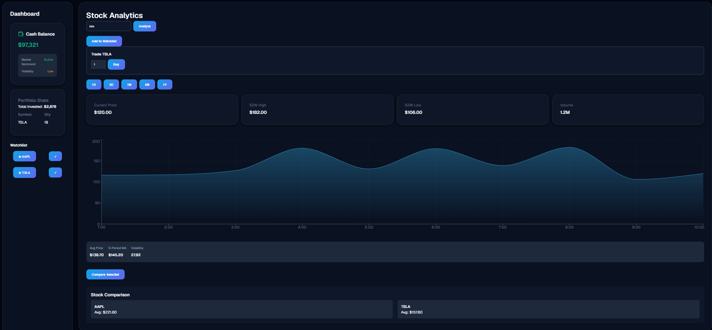

# 📈 Stock Analytics Dashboard

## 📸 Preview



A modern financial analytics dashboard built with **React.js** that transforms live market data into interactive visualizations, portfolio insights, and performance analytics through a clean, responsive, and user-focused interface.

---

## 🚀 Live Demo

**🌐 Live Application**

https://divyaprasoon-stock-analytics.vercel.app/

**📂 GitHub Repository**

https://github.com/prasoon-develop/stock-analytics-dashboard

---

## 📌 Project Overview

Stock Analytics Dashboard is a responsive React application designed to help users explore and analyze stock market data through interactive visualizations and intuitive dashboard components.

The project follows a modular architecture by separating business logic into reusable custom hooks while integrating live financial data from the Alpha Vantage API. It focuses on clean UI composition, reusable components, performance optimization, and an engaging dashboard experience.

---

## ✨ Features

### 📊 Market Analytics

- Real-time Stock Search
- Interactive Area Chart
- Dynamic KPI Cards
- Multiple Timeframe Selection
- Stock Comparison
- Portfolio Overview
- Watchlist Management

### ⚡ Engineering Features

- Component-Based Architecture
- Custom React Hooks
- API Service Layer
- Local Storage Persistence
- Responsive Dashboard Layout
- Glassmorphism UI
- Bento Grid Layout
- Skeleton Loading
- Toast Notifications
- Hover Animations
- Dark Theme

---

## 🏗️ Project Architecture

```text
src/
├── components/
│   ├── SearchBar
│   ├── ChartComponent
│   ├── KPICards
│   ├── TimeframeSelector
│   ├── PortfolioWidget
│   ├── Sidebar
│   └── ...
│
├── hooks/
│   ├── useStockData
│   ├── useLocalStorage
│   └── useComparison
│
├── api/
│   └── api.js
│
├── App.js
├── App.css
├── index.js
└── index.css
```

---

## 🛠️ Technology Stack

| Category         | Technology                      |
| ---------------- | ------------------------------- |
| Frontend         | React.js, JavaScript (ES6+)     |
| Styling          | CSS3, Glassmorphism, Bento Grid |
| Charts           | Recharts                        |
| API              | Alpha Vantage API               |
| State Management | React Hooks, Local Storage      |
| Animations       | Framer Motion                   |
| Notifications    | React Hot Toast                 |

---

## ⚙️ Engineering Highlights

- Built with a modular React architecture for better scalability and maintainability.
- Separated business logic from presentation using reusable custom hooks.
- Integrated Alpha Vantage API for real-time stock market data.
- Implemented persistent watchlists using Local Storage.
- Optimized rendering with **useMemo** and **useCallback** to reduce unnecessary re-renders.
- Designed a responsive dashboard using CSS Grid, Flexbox, and reusable UI components.
- Enhanced user experience with loading states, toast notifications, hover effects, and smooth micro-interactions.

---

## 🔄 Application Workflow

```text
User Search
      │
      ▼
Alpha Vantage API
      │
      ▼
Data Processing
      │
      ▼
React State Management
      │
      ▼
Charts & KPI Rendering
      │
      ▼
Local Storage Synchronization
```

---

## 📚 Engineering Concepts Demonstrated

- React Component Architecture
- Custom Hooks
- API Integration
- Asynchronous JavaScript
- State Management
- Memoization
- Data Visualization
- Responsive UI Development
- Component Reusability
- Performance Optimization

---

## 📅 Project Timeline

**Project Type:** Portfolio Project

**Development Period:** December 2025 – February 2026

### Phase 1 — December 2025

- Project Planning & Architecture Design
- React Project Setup
- Alpha Vantage API Integration
- Dashboard Layout Development
- Initial Stock Search Functionality

### Phase 2 — January 2026

- Interactive Area Chart Integration
- KPI Cards Implementation
- Portfolio Widget Development
- Watchlist with Local Storage
- Custom Hooks Development
- Responsive Dashboard Design

### Phase 3 — February 2026

- Stock Comparison Feature
- Timeframe Selector
- Performance Optimization using `useMemo` and `useCallback`
- Loading & Skeleton States
- Toast Notifications
- UI Refinements & Glassmorphism Enhancements
- Code Refactoring and Final Deployment

---

## 🚀 Future Enhancements

- User Authentication
- Portfolio Simulator
- CSV Export Support
- Real-Time WebSocket Data
- Advanced Portfolio Analytics

---

## ⚙️ Getting Started

Clone the repository:

```bash
git clone https://github.com/prasoon-develop/stock-analytics-dashboard.git
```

Navigate to the project directory:

```bash
cd stock-analytics-dashboard
```

Install dependencies:

```bash
npm install
```

Create a `.env` file in the project root:

```env
REACT_APP_STOCK_API_KEY=YOUR_API_KEY
```

Start the development server:

```bash
npm start
```

---

## 👨‍💻 Author

**Divya Prasoon**

B.E. Computer Science Engineering (Data Science)

Chandigarh University

---

## ⭐ Project Highlights

- 📈 Real-Time Stock Analytics Dashboard
- 📊 Interactive Financial Charts
- ⚡ Alpha Vantage API Integration
- 🧩 Component-Based React Architecture
- 🪝 Custom React Hooks
- 💾 Persistent Watchlist
- 🎨 Glassmorphism Dashboard UI
- 📱 Fully Responsive Layout
- 🚀 Optimized Rendering with Memoization
- 💼 Portfolio-Ready React Project

---

> **Built with React.js to transform live financial data into meaningful market insights through interactive analytics and a modern dashboard experience.**
